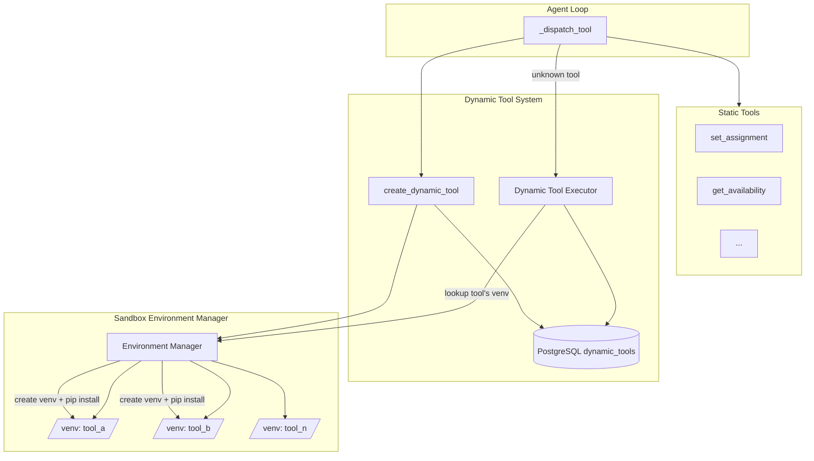

# Dynamic Tool Generation Implementation Plan

## Overview

Add the ability for the agent to dynamically generate Python tools that run in isolated subprocess environments. **Each tool has its own dedicated Python virtual environment** with its specific dependencies stored in the database. Tools are stored in PostgreSQL for reuse and can optionally be promoted to the codebase.

## Architecture



## Key Concept: Per-Tool Environments

Each dynamic tool gets its **own isolated Python virtual environment**:

- When a tool is created, its required packages (e.g., `["pandas==2.2.3", "scipy>=1.11.0"]`) are stored in the database
- A dedicated venv is created at `/sandbox-envs/<tool_name>/` with those exact dependencies
- When the tool runs, it uses its specific venv's Python interpreter
- This allows different tools to have different (even conflicting) package versions

```
/sandbox-envs/
├── calculate_fte_gap/
│   ├── bin/python
│   └── lib/python3.11/site-packages/  (pandas, numpy)
├── forecast_demand/
│   ├── bin/python
│   └── lib/python3.11/site-packages/  (pandas, scikit-learn, prophet)
└── parse_excel_report/
    ├── bin/python
    └── lib/python3.11/site-packages/  (pandas, openpyxl)
```

## File Changes

### 1. Database: New ORM Model and Migration

**File: [backend/app/orm_models.py](backend/app/orm_models.py)**

Add `DynamicToolORM` model after `AgentMemoryORM`:

```python
class DynamicToolORM(Base):
    __tablename__ = "dynamic_tools"

    id = Column(Integer, primary_key=True, autoincrement=True)
    name = Column(String(100), unique=True, nullable=False, index=True)
    description = Column(Text, nullable=False)
    parameters_schema = Column(Text, nullable=False)  # JSON string
    code = Column(Text, nullable=False)
    
    # Runtime environment specification
    python_version = Column(String(20), nullable=False, default="3.11")
    requirements = Column(Text, nullable=False)  # JSON array: ["pandas==2.2.3", "numpy>=1.26.0"]
    env_status = Column(String(20), nullable=False, default="pending")  # pending, ready, failed
    env_error = Column(Text, nullable=True)  # Error message if env creation failed
    
    created_at = Column(String, nullable=False)
    updated_at = Column(String, nullable=False)
    created_by_session_id = Column(Integer, ForeignKey("chat_sessions.id"), nullable=True)
    
    usage_count = Column(Integer, default=0)
    last_used_at = Column(String, nullable=True)
    is_verified = Column(Integer, default=0)  # 0=false, 1=true
    tags = Column(Text, nullable=True)  # JSON array string
```

**Key additions:**
- `python_version`: Python version for this tool's environment
- `requirements`: JSON array of pip requirements (e.g., `["pandas==2.2.3", "scipy>=1.11.0"]`)
- `env_status`: Track whether the venv is ready (`pending`, `ready`, `failed`)
- `env_error`: Store error message if environment creation fails

**Migration**: Create SQL migration script or use raw SQL to add the table.

### 2. Environment Manager Module

**New file: [backend/app/agent/env_manager.py](backend/app/agent/env_manager.py)**

Manages per-tool virtual environments:

```python
import subprocess
import os
import json
import shutil
from pathlib import Path
from typing import List, Optional

SANDBOX_ENVS_DIR = Path(os.environ.get("SANDBOX_ENVS_DIR", "/sandbox-envs"))

def get_tool_venv_path(tool_name: str) -> Path:
    """Get the venv path for a specific tool."""
    return SANDBOX_ENVS_DIR / tool_name

def get_tool_python(tool_name: str) -> str:
    """Get the Python interpreter path for a tool's venv."""
    return str(get_tool_venv_path(tool_name) / "bin" / "python")

def create_tool_environment(tool_name: str, requirements: List[str]) -> dict:
    """
    Create a new virtual environment for a tool and install its dependencies.
    Returns {"ok": True} or {"ok": False, "error": "..."}
    """
    venv_path = get_tool_venv_path(tool_name)
    
    try:
        # Create venv
        subprocess.run(
            ["python", "-m", "venv", str(venv_path)],
            check=True,
            capture_output=True,
            timeout=60,
        )
        
        # Install requirements
        if requirements:
            pip_path = venv_path / "bin" / "pip"
            subprocess.run(
                [str(pip_path), "install", "--no-cache-dir"] + requirements,
                check=True,
                capture_output=True,
                timeout=300,  # 5 min timeout for pip install
            )
        
        return {"ok": True}
    except subprocess.CalledProcessError as e:
        return {"ok": False, "error": e.stderr.decode() if e.stderr else str(e)}
    except Exception as e:
        return {"ok": False, "error": str(e)}

def delete_tool_environment(tool_name: str) -> None:
    """Remove a tool's virtual environment."""
    venv_path = get_tool_venv_path(tool_name)
    if venv_path.exists():
        shutil.rmtree(venv_path)

def environment_exists(tool_name: str) -> bool:
    """Check if a tool's environment exists and has a Python interpreter."""
    python_path = Path(get_tool_python(tool_name))
    return python_path.exists()
```

### 3. Sandbox Executor Module

**New file: [backend/app/agent/sandbox.py](backend/app/agent/sandbox.py)**

```python
import subprocess
import tempfile
import json
import os
from typing import Any
from .env_manager import get_tool_python, environment_exists

TIMEOUT_SECONDS = 30

def execute_in_sandbox(tool_name: str, code: str, function_name: str, args: dict) -> dict:
    """
    Execute dynamic tool code in the tool's isolated virtual environment.
    
    Each tool has its own venv with its specific dependencies.
    """
    if not environment_exists(tool_name):
        return {"ok": False, "error": f"Environment for tool '{tool_name}' not ready"}
    
    python_path = get_tool_python(tool_name)
    
    runner_code = f'''
import json
import sys
import resource

# Resource limits
resource.setrlimit(resource.RLIMIT_CPU, (10, 10))
resource.setrlimit(resource.RLIMIT_AS, (256 * 1024 * 1024, 256 * 1024 * 1024))

{code}

if __name__ == "__main__":
    args = json.loads(sys.argv[1])
    try:
        result = {function_name}(**args)
        print(json.dumps({{"ok": True, "result": result}}, default=str))
    except Exception as e:
        print(json.dumps({{"ok": False, "error": str(e)}}))
'''
    
    with tempfile.NamedTemporaryFile(mode='w', suffix='.py', delete=False) as f:
        f.write(runner_code)
        script_path = f.name
    
    try:
        result = subprocess.run(
            [python_path, script_path, json.dumps(args)],
            capture_output=True,
            text=True,
            timeout=TIMEOUT_SECONDS,
            env={},  # Empty env - no access to main app's env vars
        )
        
        os.unlink(script_path)
        
        if result.returncode == 0:
            return json.loads(result.stdout)
        return {"ok": False, "error": result.stderr or "Unknown error"}
    except subprocess.TimeoutExpired:
        os.unlink(script_path)
        return {"ok": False, "error": "Execution timed out"}
    except json.JSONDecodeError:
        return {"ok": False, "error": f"Invalid output: {result.stdout}"}
```

### 4. Dynamic Tool Storage Functions

**New file: [backend/app/agent/dynamic_tools.py](backend/app/agent/dynamic_tools.py)**

CRUD operations for dynamic tools:

```python
from datetime import datetime
from typing import List, Optional
from sqlalchemy.orm import Session
from ..orm_models import DynamicToolORM
from .env_manager import create_tool_environment, delete_tool_environment
import json

def create_dynamic_tool(
    db: Session,
    name: str,
    description: str,
    parameters_schema: dict,
    code: str,
    requirements: List[str],
    session_id: Optional[int] = None,
    tags: Optional[List[str]] = None,
) -> DynamicToolORM:
    """Create a new dynamic tool and set up its environment."""
    now = datetime.utcnow().isoformat()
    
    tool = DynamicToolORM(
        name=name,
        description=description,
        parameters_schema=json.dumps(parameters_schema),
        code=code,
        requirements=json.dumps(requirements),
        env_status="pending",
        created_at=now,
        updated_at=now,
        created_by_session_id=session_id,
        tags=json.dumps(tags) if tags else None,
    )
    db.add(tool)
    db.commit()
    db.refresh(tool)
    
    # Create the tool's virtual environment (async in production)
    result = create_tool_environment(name, requirements)
    if result["ok"]:
        tool.env_status = "ready"
    else:
        tool.env_status = "failed"
        tool.env_error = result["error"]
    
    db.commit()
    db.refresh(tool)
    return tool

def get_dynamic_tool_by_name(db: Session, name: str) -> Optional[DynamicToolORM]:
    return db.query(DynamicToolORM).filter(DynamicToolORM.name == name).first()

def list_dynamic_tools(db: Session) -> List[DynamicToolORM]:
    return db.query(DynamicToolORM).all()

def increment_usage(db: Session, tool_id: int) -> None:
    tool = db.query(DynamicToolORM).filter(DynamicToolORM.id == tool_id).first()
    if tool:
        tool.usage_count += 1
        tool.last_used_at = datetime.utcnow().isoformat()
        db.commit()

def delete_dynamic_tool(db: Session, name: str) -> bool:
    tool = get_dynamic_tool_by_name(db, name)
    if tool:
        delete_tool_environment(name)  # Remove the venv
        db.delete(tool)
        db.commit()
        return True
    return False
```

### 5. Tool Schema Additions

**File: [backend/app/agent/tools.py](backend/app/agent/tools.py)**

Add new tool schemas to `TOOLS` list:

```python
{
    "type": "function",
    "function": {
        "name": "create_dynamic_tool",
        "description": "Create a reusable Python tool with its own isolated environment. Specify the required packages and they will be installed in a dedicated virtual environment for this tool.",
        "parameters": {
            "type": "object",
            "properties": {
                "name": {
                    "type": "string",
                    "description": "Snake_case tool name (e.g., 'calculate_fte_gap')"
                },
                "description": {
                    "type": "string",
                    "description": "What the tool does"
                },
                "parameters_schema": {
                    "type": "object",
                    "description": "JSON Schema for the tool's parameters"
                },
                "code": {
                    "type": "string",
                    "description": "Python function code. Must define a function with the same name as the tool."
                },
                "requirements": {
                    "type": "array",
                    "items": {"type": "string"},
                    "description": "Python packages to install (e.g., ['pandas==2.2.3', 'scipy>=1.11.0'])"
                },
                "tags": {
                    "type": "array",
                    "items": {"type": "string"},
                    "description": "Optional tags for categorization"
                }
            },
            "required": ["name", "description", "parameters_schema", "code", "requirements"]
        }
    }
},
{
    "type": "function",
    "function": {
        "name": "list_dynamic_tools",
        "description": "List all available dynamic tools that have been created, including their environment status.",
        "parameters": {"type": "object", "properties": {}}
    }
},
{
    "type": "function",
    "function": {
        "name": "delete_dynamic_tool",
        "description": "Delete a dynamic tool and its virtual environment.",
        "parameters": {
            "type": "object",
            "properties": {
                "name": {"type": "string", "description": "Name of the tool to delete"}
            },
            "required": ["name"]
        }
    }
}
```

Add to `READ_ONLY_TOOLS`: `"list_dynamic_tools"`

### 6. Executor Integration

**File: [backend/app/agent/executor.py](backend/app/agent/executor.py)**

Add execution functions and update dispatch:

```python
from .dynamic_tools import (
    get_dynamic_tool_by_name,
    create_dynamic_tool as db_create_dynamic_tool,
    list_dynamic_tools as db_list_dynamic_tools,
    delete_dynamic_tool as db_delete_dynamic_tool,
    increment_usage,
)
from .sandbox import execute_in_sandbox
import json
import ast

def _validate_code_syntax(code: str, function_name: str) -> Optional[str]:
    """Validate Python code syntax. Returns error message or None if valid."""
    try:
        tree = ast.parse(code)
        # Check that a function with the expected name exists
        func_names = [node.name for node in ast.walk(tree) if isinstance(node, ast.FunctionDef)]
        if function_name not in func_names:
            return f"Code must define a function named '{function_name}'"
        return None
    except SyntaxError as e:
        return f"Syntax error: {e}"

def _execute_create_dynamic_tool(db, args, session_id) -> str:
    name = args["name"]
    code = args["code"]
    
    # Validate code syntax
    error = _validate_code_syntax(code, name)
    if error:
        return f"ERROR: {error}"
    
    # Check if tool already exists
    if get_dynamic_tool_by_name(db, name):
        return f"ERROR: Tool '{name}' already exists"
    
    tool = db_create_dynamic_tool(
        db=db,
        name=name,
        description=args["description"],
        parameters_schema=args["parameters_schema"],
        code=code,
        requirements=args.get("requirements", []),
        session_id=session_id,
        tags=args.get("tags"),
    )
    
    if tool.env_status == "failed":
        return f"ERROR: Tool created but environment setup failed: {tool.env_error}"
    
    return f"OK: Created tool '{name}' with environment status: {tool.env_status}"

def _execute_list_dynamic_tools(db) -> str:
    tools = db_list_dynamic_tools(db)
    if not tools:
        return "OK: No dynamic tools have been created yet."
    
    lines = ["OK: Available dynamic tools:"]
    for t in tools:
        reqs = json.loads(t.requirements) if t.requirements else []
        lines.append(f"- {t.name}: {t.description}")
        lines.append(f"  Requirements: {', '.join(reqs) if reqs else 'none'}")
        lines.append(f"  Status: {t.env_status}, Used: {t.usage_count} times")
    return "\n".join(lines)

def _execute_delete_dynamic_tool(db, args) -> str:
    name = args["name"]
    if db_delete_dynamic_tool(db, name):
        return f"OK: Deleted tool '{name}' and its environment"
    return f"ERROR: Tool '{name}' not found"

def _execute_dynamic_tool(db, tool: DynamicToolORM, args: dict) -> str:
    if tool.env_status != "ready":
        return f"ERROR: Tool environment not ready (status: {tool.env_status})"
    
    result = execute_in_sandbox(tool.name, tool.code, tool.name, args)
    increment_usage(db, tool.id)
    
    if result["ok"]:
        return f"OK: {result['result']}"
    return f"ERROR: {result['error']}"

def _dispatch_tool(fn_name, args, db, user_id=None, session_id=None):
    match fn_name:
        # ... existing cases ...
        case "create_dynamic_tool":
            return _execute_create_dynamic_tool(db, args, session_id)
        case "list_dynamic_tools":
            return _execute_list_dynamic_tools(db)
        case "delete_dynamic_tool":
            return _execute_delete_dynamic_tool(db, args)
        case _:
            # Check dynamic tools before returning error
            tool = get_dynamic_tool_by_name(db, fn_name)
            if tool:
                return _execute_dynamic_tool(db, tool, args)
            return f"ERROR: Unknown tool '{fn_name}'"
```

### 7. Railway Configuration

**New file: [backend/Dockerfile](backend/Dockerfile)**

Railway currently uses nixpacks. Switch to Dockerfile for environment management:

```dockerfile
FROM python:3.11-slim

WORKDIR /app

# System dependencies for building Python packages
RUN apt-get update && apt-get install -y --no-install-recommends \
    gcc g++ libpq-dev python3-dev && rm -rf /var/lib/apt/lists/*

# Main app dependencies
COPY requirements.txt .
RUN pip install --no-cache-dir -r requirements.txt

# Create directory for per-tool sandbox environments
RUN mkdir -p /sandbox-envs && chmod 755 /sandbox-envs
ENV SANDBOX_ENVS_DIR=/sandbox-envs

# Copy application
COPY . .

CMD ["uvicorn", "app.main:app", "--host", "0.0.0.0", "--port", "8000"]
```

**Key points:**
- No pre-built sandbox venv - environments are created dynamically per tool
- `/sandbox-envs/` directory holds all tool-specific venvs
- Build tools (gcc, g++, python3-dev) included for compiling packages like numpy/scipy

**Update: [backend/railway.toml](backend/railway.toml)**

```toml
[build]
builder = "dockerfile"
dockerfilePath = "Dockerfile"

[deploy]
startCommand = "uvicorn app.main:app --host 0.0.0.0 --port $PORT"
```

### 8. Context Update

**File: [backend/app/agent/context.py](backend/app/agent/context.py)**

Add dynamic tools to system prompt so the agent knows what's available:

```python
from .dynamic_tools import list_dynamic_tools
import json

def build_system_prompt(db: Session, ...):
    # ... existing code ...
    
    # Add dynamic tools section
    dynamic_tools = list_dynamic_tools(db)
    if dynamic_tools:
        lines.append("\n## Available Dynamic Tools")
        lines.append("These are custom tools that have been created. You can call them directly by name.")
        for t in dynamic_tools:
            if t.env_status == "ready":
                reqs = json.loads(t.requirements) if t.requirements else []
                lines.append(f"- {t.name}: {t.description}")
                if reqs:
                    lines.append(f"  (packages: {', '.join(reqs)})")
```

## Security Considerations

- **Per-tool isolation**: Each tool runs in its own venv with only its declared dependencies
- **No shared state**: Tools cannot access each other's environments
- **No DB access**: Tool venvs have no SQLAlchemy/psycopg2 - cannot connect to database
- **No network by default**: Don't install requests/httpx unless explicitly needed
- **No API keys**: Environment variables from main app are not passed to subprocess (`env={}`)
- **Resource limits**: CPU time (10s), memory (256MB), execution timeout (30s)
- **Code validation**: Syntax check and function name verification before storing
- **Disk space**: Consider adding cleanup for unused tool environments

## Storage Considerations

**Railway disk persistence:**
- Railway containers have ephemeral filesystems by default
- Tool venvs in `/sandbox-envs/` will be lost on redeploy
- Options:
  1. **Recreate on startup**: Add startup logic to recreate venvs for all tools with `env_status="ready"`
  2. **Railway Volume**: Attach a persistent volume to `/sandbox-envs/` (recommended for production)
  3. **Accept rebuild time**: First execution after deploy recreates the venv

**Recommended approach**: Add a startup task that checks for missing venvs and recreates them:

```python
# In main.py lifespan or startup event
async def ensure_tool_environments():
    """Recreate any missing tool environments on startup."""
    tools = db_list_dynamic_tools(db)
    for tool in tools:
        if tool.env_status == "ready" and not environment_exists(tool.name):
            requirements = json.loads(tool.requirements)
            result = create_tool_environment(tool.name, requirements)
            if not result["ok"]:
                tool.env_status = "failed"
                tool.env_error = result["error"]
                db.commit()
```

## Testing Strategy

1. Unit tests for `env_manager.py` - venv creation/deletion
2. Unit tests for `sandbox.py` - code execution with various inputs
3. Integration tests for full create/execute/delete flow
4. Test resource limit enforcement (infinite loop, memory bomb)
5. Test environment isolation (tool A can't access tool B's packages)
6. Test startup recovery (recreate missing venvs)

## Future Enhancements (Not in Scope)

- Tool promotion CLI to generate static tool code
- Tool versioning and rollback
- Async environment creation (background task)
- Environment caching/sharing for common requirement sets
- User ratings and feedback
- Automatic tool suggestions based on query patterns

## Implementation Checklist

- [ ] Add DynamicToolORM model to orm_models.py (with requirements, env_status fields)
- [ ] Create database migration for dynamic_tools table
- [ ] Create env_manager.py for per-tool venv management
- [ ] Create sandbox.py with subprocess execution logic
- [ ] Create dynamic_tools.py with CRUD operations
- [ ] Add create_dynamic_tool, list_dynamic_tools, delete_dynamic_tool schemas to tools.py
- [ ] Update executor.py with new tool handlers and dispatch logic
- [ ] Create Dockerfile with /sandbox-envs directory
- [ ] Update railway.toml to use Dockerfile builder
- [ ] Add startup task to recreate missing tool environments
- [ ] Update context.py to include dynamic tools in system prompt
- [ ] Add tests for environment management and sandbox execution
